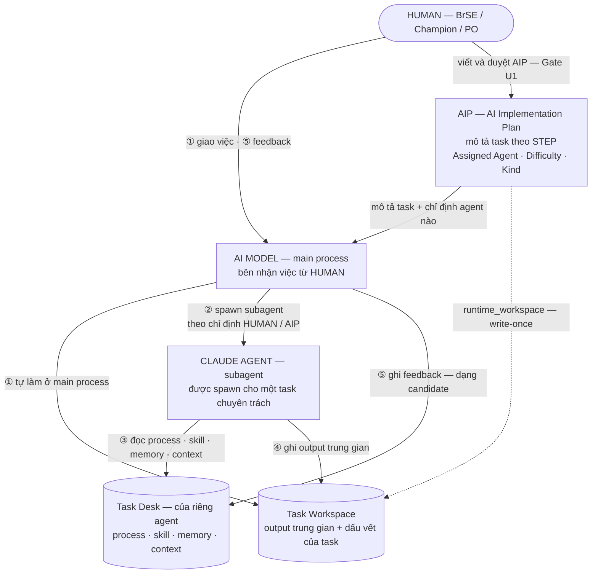

# Agent Concept Map — ai giao việc cho ai, và mọi thứ nằm ở đâu

> **Status: CANONICAL (beta) — AI Agents Pack**, version: see `PACK_VERSION.md` (pack root).
> Added by **CR-AIWS-2026-08-038** (2026-08-14). HUMAN-facing, VN-primary.
>
> **Mục đích:** một trang trả lời đúng bốn câu hỏi hay lẫn nhất — *AI model, Claude agent, Task Desk,
> AIP, Task Workspace là gì; ai giao việc cho ai; cái gì được ghi ở đâu; cái gì cần HUMAN duyệt.*
>
> Đây là lớp **khái niệm & quan hệ**, không transcribe chi tiết lệnh. Chi tiết per-command:
> `command_usage_guide.md`. Cơ chế runtime đầy đủ: `../agent_runtime_design.md`. Vận hành hằng ngày:
> `user_guide.md`.
>
> **Bản sơ đồ màu** (để chiếu / chia sẻ / in): `agent_concept_map.html` — cùng thư mục, mở bằng trình duyệt.

---

## 0. Đường đi của một việc

Đọc theo số:

1. **HUMAN giao việc cho AI model** ở main process — không giao thẳng cho một agent, cũng không giao
   cho Task Desk. Việc có thể được mô tả sẵn trong một STEP của AIP.
2. **AI model chọn một trong hai đường:** tự làm ngay ở main process (`executor: main_session`), hoặc
   **spawn subagent** (`executor: claude_subagent`). Chọn đường nào là **do HUMAN chỉ định hoặc do AIP
   mô tả** — model không tự ý spawn.
3. **Subagent đọc năng lực từ Task Desk của chính nó** — process, skill/tools, confirmed memory, context.
4. **Output trung gian ra Task Workspace** — cả hai đường đều vậy, kể cả khi main process tự làm.
5. **Feedback cũng đi qua AI model**: HUMAN nói với model, model ghi vào Task Desk dạng *candidate*;
   phải HUMAN duyệt mới thành memory hoặc mới sửa process/skill.

---

## 1. Sáu thành phần trong một bảng

| Thành phần | Là gì | Sống bao lâu | Ở đâu |
|---|---|---|---|
| **HUMAN** | Chủ việc: giao việc, feedback, gate | — | — |
| **AI model — main process** | Bên nhận việc; tự làm hoặc spawn subagent | Theo phiên làm việc | — |
| **Claude agent (subagent)** | Được spawn để làm một task chuyên trách | **Stateless theo run** | shim `.claude/agents/<desk_id>.md` |
| **AIP** | Kế hoạch: mô tả task theo STEP + chỉ định agent | Theo một công việc | `.ai-work/aip/<account>/exec/AIP-EXEC-nnn.md` |
| **Task Desk (ATD)** | Đồ nghề + trí nhớ **của riêng một agent** | **Bền vững qua nhiều task** | `<pack-root>/agents/task_desks/<desk_id>/` |
| **Task Workspace** | Nơi ghi output trung gian + dấu vết của task | Theo một task; xong thì đóng | `.ai-work/workspaces/<account>/<task_id>/` |

Hai câu để không bao giờ lẫn Desk với Workspace:

- **Task Desk giữ "agent biết gì"** — process, skill, những gì đã học và được duyệt.
- **Task Workspace giữ "task này đã làm gì"** — findings, draft, output, capture, run state.
- Task xong thì **workspace đóng lại; desk sống tiếp**.

Bên trong một Task Desk:

| Đường dẫn | Nội dung |
|---|---|
| `desk.yaml` | identity · `capability` · `run_policy` (executor, aip_driven, plan_first) |
| `process/` | quy trình nghiệp vụ của agent |
| `tools/` | tool bindings + local tools |
| `memory/confirmed_memory.jsonl` | cái đã học **và đã được HUMAN duyệt** |
| `context/` | `wiki_references.yaml` (kèm `lookup_intents`) · `source_priority` · `working_inventory` · `ignored_paths` |
| `training/` | `feedback_log.jsonl` · `candidate_queue.jsonl` — hàng chờ, chưa phải memory |
| `workspace/` | run-folder khi chạy **không** có AIP dẫn |
| `run_index.jsonl` | back-pointer tới các run nằm trong Task Workspace |

---

## 2. Phân vai — ai giữ gì, ai quyết gì

Chỉ **ba** thứ thật sự "hành động": HUMAN, AI model (main process), subagent. AIP · Task Desk ·
Task Workspace là **dữ liệu**. Tooling là bên gác cổng, không suy luận.

| Thành phần | Giữ state gì | Được quyết gì | Không được làm |
|---|---|---|---|
| **HUMAN** | Ý định + tiêu chí nghiệm thu | Nghiệp vụ · xung đột source-of-truth · **có spawn subagent hay không** · mọi promotion | — |
| **AI model (main process)** | Context của phiên chính — không bền vững | Cách làm ở main process · relay quyết định của HUMAN · verify kết quả subagent | Tự ý spawn khi chưa được chỉ định · tự chốt nghiệp vụ · ghi thẳng `confirmed_memory` |
| **Claude agent (subagent)** | Không giữ gì — stateless theo run | Cách làm, trong phạm vi `process/` và boundary của desk | Tự chốt nghiệp vụ · ghi thẳng memory · **spawn agent khác** |
| **Tooling `run_agent.py`** | `run_state.yaml` · ARC · run folder | Cho chạy hay không — cơ học, xác định | **Gọi LLM · spawn agent · tự làm task** |
| **AIP** | STEP · `Assigned Agent` · Expected Outputs · done criteria | — không phải tác nhân | Bị sửa tay giữa lúc chạy |
| **Task Desk** | `process/` · skill · `memory/` · `context/` | — không phải tác nhân | Bị ghi thẳng vào `confirmed_memory` |
| **Task Workspace** | Output trung gian · findings · capture · run state | — không phải tác nhân | Chứa thứ thuộc về desk (memory/process của agent) |

---

## 3. Kênh giao tiếp — ai nói với ai, qua cái gì

AIWS là **file-first**: trừ cặp HUMAN↔model và lệnh spawn, mọi giao tiếp còn lại đều đi qua file trong
repo — đọc lại được, lint được, không có kênh ngầm.

| Từ → Đến | Kênh | Gate / ràng buộc |
|---|---|---|
| HUMAN → AI model | Prompt hội thoại, hoặc `/aiws-agent run start <agent> --aip … --step …` | Không auto-run, không chain |
| HUMAN → AI model (feedback) | Nói trong hội thoại, hoặc `/aiws-agent-feedback <run>` | Cùng kênh với giao việc — HUMAN không phải tự mở file desk |
| AIP → AI model | STEP + `Assigned Agent` · `Difficulty` · `Kind` | Dispatch eligibility + capability routing quyết được spawn hay không |
| AI model → subagent | Spawn theo shim `.claude/agents/<desk_id>.md` + dispatch brief 3 block | **Chỉ spawn khi HUMAN chỉ định hoặc AIP mô tả** |
| subagent → AI model | Hand-off contract: summary + self-assessment + **pointers** | Main **verify** bằng chứng, không re-judge verdict |
| AI model → Task Desk | Ghi `training/feedback_log.jsonl` + `training/candidate_queue.jsonl`; run-folder ghi `human_feedback.md` + `learning_candidates.jsonl` | Ghi **candidate**; `/aiws-agent-review-learning` + HUMAN duyệt mới vào `confirmed_memory` hoặc `process/`·skill |
| subagent → Task Desk | Đọc `process/`·skill·`memory/`·`context/` theo **scoped-load** (digest + hints) | Không ghi thẳng `confirmed_memory.jsonl` |
| main process / subagent → Task Workspace | `output/` · `04_findings` · `05_open_questions` · `07_output_draft` · `08_capture_inbox.jsonl` · `run_state.yaml` | Boundary guard: không ghi ra ngoài |
| subagent ⇄ subagent | Mailbox `messages_out.jsonl` / `messages_in.jsonl`, main merge về `messages.jsonl` | `business_rule` / `sot_conflict` = **HUMAN-only**, main chỉ relay |
| Tooling → file | Dựng ARC, `run_state.yaml`, run folder | Boundary guard theo pack root + Task Workspace được allow-list |

> **Ngoại lệ hiếm:** HUMAN tự mở và sửa tay file trong Task Desk. Có xảy ra, nhưng **không phải đường
> chuẩn** — mô hình vận hành mặc định là feedback đi qua AI model.

### 3.1 Hai kênh KHÔNG tồn tại

| Kênh | Vì sao không có |
|---|---|
| `run_agent.py` → AI model | Tooling **không bao giờ gọi LLM**. Nó chạy gate, dựng ARC, scaffold run rồi dừng; main process mới là bên gọi model và bên spawn. Đây là bất biến giữ cho tooling luôn kiểm chứng được (`agent_runtime_design.md` §6, §8D). |
| subagent → spawn agent | Tool `Agent` bị **loại khỏi whitelist** của shim. Chỉ main process được spawn, và chỉ khi được chỉ định (`agent_runtime_design.md` §8E). |

---

## 4. Việc đến từ đâu ⇒ run nằm ở đâu

Đây là chỗ hay nhầm nhất giữa "Task Workspace" và "workspace bên trong desk".

| Việc đến từ | Run nằm ở | Ghi chú |
|---|---|---|
| **AIP mô tả** — desk `aip_driven`, start có `--aip` | `<TW>/runs/<run_id>/` bên trong Task Workspace của AIP | Không tạo workspace thứ hai; desk chỉ giữ `run_index.jsonl` làm back-pointer. Nhiều subagent dùng chung một TW — mỗi lúc **một run active**; `run_log.jsonl` ở gốc TW là chain ledger. |
| **HUMAN chỉ định trực tiếp** — không có `--aip` | `<desk>/workspace/active_runs/RUN-…` → xong chuyển `completed_runs/` | Dành cho việc nhỏ. Việc đáng kể vẫn nên mô tả trong AIP để có kế hoạch và traceability. |

---

## 5. Bất biến cần nhớ

1. **HUMAN giao việc cho AI model ở main process**, không giao thẳng cho subagent. Subagent chỉ xuất
   hiện khi được spawn.
2. **Spawn subagent phải do HUMAN chỉ định hoặc AIP mô tả.** Main process không tự ý lập một agent để
   làm hộ. *(CR-AIWS-2026-08-044 mở rộng: cả **executor** lẫn **tier** đều là lựa chọn plan-time của
   HUMAN/AIP — step field `Executor:`, `Assigned Agent:` — model không có quyền tùy nghi tại dispatch.)*
3. **Task Desk là của riêng subagent** — đồ nghề và trí nhớ, không phải nơi nhận việc.
3b. **Default = KHÔNG chỉ định (CR-AIWS-2026-08-044 C0).** Step không khai `Assigned Agent:` → AI model
   tự làm ở main process như AIWS thuần — không run, không desk nào tham gia; `Difficulty`/`Kind` đứng
   một mình chỉ là metadata. Muốn dùng đồ nghề desk để THỰC THI → bắt buộc mở một RUN executor
   `main_session` (tra cứu read-only `list`/`memory` thì tự do). Dự án tắt/bật cả cơ chế dispatch qua
   `pack_config.yaml dispatch_enabled` (vắng = ON).
4. **Output trung gian luôn ra Task Workspace**, kể cả khi main process tự làm và không spawn ai.
5. **Feedback đi qua AI model rồi mới vào Task Desk**, và vào dưới dạng candidate. HUMAN duyệt mới
   thành memory hoặc mới sửa process/skill.
6. **Tooling không gọi model; subagent không spawn agent.** Chỉ main process được spawn.
7. **Không auto-promotion ở bất kỳ lớp nào:** output = evidence · learning = candidate · Wiki, memory,
   blueprint chỉ đổi sau khi HUMAN duyệt.

---

## 6. Đối chiếu thuật ngữ với `agent_runtime_design.md` §0

Trang này mô tả **góc nhìn vận hành** — *ai giao việc cho ai*. §0 của `agent_runtime_design.md` định
nghĩa **mô hình thực thể** — *cái gì là thực thể bền vững*. Hai cách gọi không mâu thuẫn, nhưng đặt cạnh
nhau dễ tưởng là khác nhau, nên đối chiếu ở đây:

| Trang này gọi | §0 gọi | Ghi chú |
|---|---|---|
| AI model — main process | *the main session acting-as-agent* (`executor: main_session`) | §0 coi main session khi thực thi là một "agent"; trang này tách riêng vì đó là **bên nhận việc từ HUMAN**, khác vai với subagent. |
| Claude agent (subagent) | *a Claude sub-agent* (`executor: claude_subagent`) | Cùng một thứ. |
| Task Desk của riêng agent | *agent task desk (ATD)* — thực thể AIWS bền vững per role | Cùng một thứ. §0 nhấn "state sống ở desk"; trang này nhấn "desk thuộc về agent nào". |
| — | *agent task desk blueprint (ATDB)* | Template tạo desk; ngoài phạm vi trang này — xem `agent_authoring_guide.md`. |

---

## 7. Tham chiếu

| Cần biết | Đọc |
|---|---|
| Cơ chế runtime đầy đủ: run model · ARC · mailbox · executor · capability routing | `../agent_runtime_design.md` §1 · §3 · §8A–§8E |
| Chi tiết từng lệnh (create / run / feedback / review-learning / upgrade / clone / rename) | `command_usage_guide.md` |
| Vận hành hằng ngày với 3 agent hiện có | `user_guide.md` |
| Cài đặt + wiring context tới Knowledge Hub | `setup_guide.md` |
| Viết / sửa blueprint (ATDB) | `agent_authoring_guide.md` |
| Giới hạn đã biết (gồm L-10 shim registration lag) | `known_limitations_and_backlog.md` |
| Giao việc cho agent khi lập AIP: assign cả AIP / một step / token economy | `.ai-work/guidelines/AGENT_USAGE_GUIDE.md` khi cài (canonical: `product/guidelines/AGENT_USAGE_GUIDE.md`) — CR-AIWS-2026-08-037 |

---

## Revision History

| Date | Rev | Change |
|---|---|---|
| 2026-08-14 | v1 | Tạo mới — added by CR-AIWS-2026-08-038 |
| 2026-08-14 | v2 | §5: invariant #2 mở rộng (executor/tier plan-time) + #3b default-không-chỉ-định + toggle + luật run-bắt-buộc — applied by CR-AIWS-2026-08-044 |
