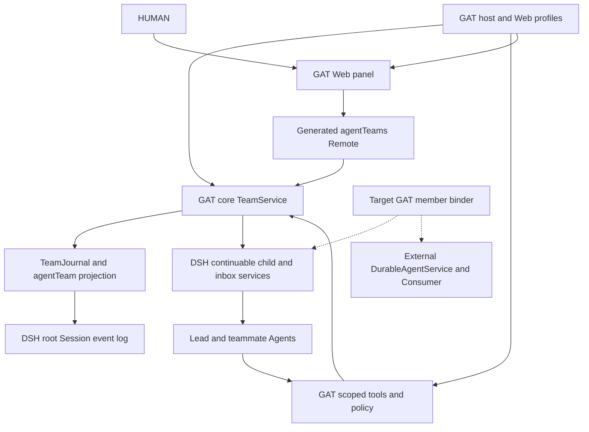

# GAT Architecture Design

Document ID: GAT-AD-001  
Version: 1.0-draft  
Source inspection date: 2026-10-04 (Asia/Tokyo)  
Status: Formal project design draft for review; not canonical Truth, release approval or activation authority.

**Source code is the source of truth for implemented behavior.** Historical/target documents inform comparison; they do not override current source.

## 1. Purpose, scope and design baseline

Describe the architecture of Governed Agent Team (GAT), the responsibilities of its packages, durable authority boundaries and the intended Durable Agent integration. This document consolidates the [collected design sources](README.md) and [mission deltas](MISSION_DESIGN_DELTAS.md), with current implementation inspected separately.

The inspected GAT HEAD is `d7a2eec9adbc14f6d892c7f4722ec2061d67e227`, with pre-existing uncommitted edits in core projection/roster/types and tests. [Source baseline](source-baseline.json) binds the exact inspected files. A commit alone does not identify these working-tree bytes. No product suite or deployment was performed for this documentation revision.

Use these status terms throughout the design set:

| Status | Meaning |
|---|---|
| Current | Present in inspected source; test mappings identify relevant fixtures, not a new PASS claim |
| Standalone | Implemented in `packages/gat`, explicitly inactive/not integrated into DSH |
| External | Present in the sibling Durable Agent package; adoption by GAT is not established |
| Target | Frozen/planned design requiring implementation or integration evidence |
| Historical | Mission evidence or predecessor design; may differ from current source |

This architecture covers the DSH Team runtime, browser surface, installation boundary, standalone Conservative MVP and external member capability. WBS execution controls and AIWS knowledge promotion are project processes, not new GAT runtime components.

## 2. Actors and system context

| Actor/system | Responsibility |
|---|---|
| HUMAN | Requests work, reviews plans/results and supplies approval through the applicable host/process boundary |
| Lead Agent | Root Session owner; creates teammates, coordinates shared tasks and messages |
| Teammate Agent | Continuable direct child Session; claims work, communicates and reports evidence |
| DSH host | Agent/Session identity, continuable subagents, inbox, model requests, tools, persistence, generated Remote and profile lifecycle |
| Durable Agent service | Explicit member profile, context, selective memory and persistent working capability |
| Browser client | Displays projected Team state and invokes generated Remote operations |

All DSH Team members share a checkout. Task write scopes support coordination and overlap diagnostics; they do not provide filesystem isolation.

## 3. Runtime component architecture

Solid edges represent current integration. Dashed edges represent target member binding, not verified production wiring.

| Component | Package/home | Responsibility | Status |
|---|---|---|---|
| Team domain | `packages/core` / `@vuhoi/gat-core` | Identity/roster, journal/projection, task DAG, missions, mailbox, work state and runtime recovery | Current |
| Model interface | `packages/tools` / `@vuhoi/gat-tools` | Scoped tools/policy, workspace config, route preflight, execution-readiness guard and Enable initializer | Current |
| Browser | `packages/web` / `@vuhoi/gat-web` | Remote mount, conversation-header panel, polling and navigation | Current |
| Host profile | `packages/profile` | Ordered core/tools composition and legacy-control replacement via YAML patch | Current |
| Web profile | `packages/web-profile` | Browser composition and refresh/stall timing | Current |
| Distribution | `installer`, `compatibility`, `scripts` | Compatibility classification, controlled install/rollback and installed verification | Current |
| Conservative MVP | `packages/gat` | Governance identities, partitioned memory, policy/selectors, wrapper and conformance tooling | Standalone |
| Member capability | Sibling `dsh-durable-agent/durable-agent-plugin` | Versioned service, local provider, Consumer and standalone adapter | External |

The standalone package is a separate implementation stream. Its `PACKAGE_STATUS` declares inactive proposal, conformance not executed, and DSH/MCP not integrated. Its in-memory registries are not the root Session journal or a production durable database.

## 4. Authority and storage architecture

| Domain | Authoritative owner/store | Consumers | Constraint |
|---|---|---|---|
| Team membership, tasks, missions, mailbox and work | Root DSH Session event log; `agentTeam` projection | Core commands, tools and Web views | No independent UI or Durable Agent coordination store |
| Child execution and inbox acceptance | DSH Agent/Session/subagent services | Roster recovery and mailbox dedupe | Child history must be checked outside inherited fork prefix |
| Runtime status and in-flight operations | Process-local Agent registry/lifecycle | Views, guards and disposal | Runtime status differs from durable member phase |
| Member profile/context/memory | External Durable Agent provider | Explicitly bound Consumer/target binder | Does not authorize Team/task/model effects |
| Standalone reference-memory partitions | Conservative MVP `PartitionStore` and injected audit/anchor/lifecycle registries | Standalone policy/wrapper | No assumption of production DSH or persistent backend integration |
| Mission research/acceptance evidence | `wbs-runs` reports/ledgers and collection manifest | Design authors/reviewers | Historical evidence is not automatic runtime authority |

Current missions retain embedded task snapshots while the shared task board is separate. The target contract requires task `missionId` association and one executable task authority; that migration is not present in current `TeamTaskSnapshot`.

## 5. Architecture decisions

| ID | Decision | Status / consequence |
|---|---|---|
| AD-01 | TeamId is the branded root SessionId; the root is Lead and teammates are direct continuable children | Current; exact live Agent identity is the command credential |
| AD-02 | Root Session journal and deterministic projection own Team state | Current; readers do not maintain a second coordination database |
| AD-03 | Flush durable events before publishing mutation completion/activity | Current; serialization is per root; not a database rollback guarantee |
| AD-04 | Separate durable member phase from runtime Agent status | Current; restart requires child evidence rather than inferred success |
| AD-05 | Opt-in profile installation and per-Session Enable are separate controls | Current; enabled is derived from retained teammate rows, not a separate Boolean event |
| AD-06 | Workspace declarations are bounded configuration and model routes are preflighted before provisioning | Current; invalid declaration selects defaults; route failures stop provisioning |
| AD-07 | Team dispatch enforcement lives in scoped tool guards | Current name-based external-delegation denial; immutable nested capability metadata is Target |
| AD-08 | Capability services own their data; GAT persists only bounded opaque attachments | Target; required-only attachment binding and recovery gate precede model admission |
| AD-09 | Exact host-attested HUMAN mission authorization must bind effectful dispatch | Target; current immediate mission approval and simple-mode shortcut do not prove HUMAN provenance |
| AD-10 | Member task runner consumes one normalized contracted task; PM/Team retains orchestration and acceptance | Target/PoC line; not delivered by the external memory-service mission |
| AD-11 | Standalone reference memory and external member memory remain separate subsystems | Standalone/External; no implicit migration between them |
| AD-12 | Compatibility, source drift and post-install verification are separate distribution concerns | Current installer implementation; inspect installed evidence before release claims |

## 5.1. Decision rationale — WHY and evidence

Source defines current behavior; the documents below explain design intent. A historical motivation can remain useful even when current implementation differs. Inferences and unsupported shortcuts are identified explicitly in the corresponding Detail Design WHY paragraphs.

| Decision | Problem / WHY | Rationale evidence and implementation limit |
|---|---|---|
| AD-01 / AD-02 | Reuse the existing Team runtime and keep UI, tools and recovery from composing conflicting status stores | Golden V1: Existing foundation, Evidence and lessons applied; feature reference §§4,7.2 |
| AD-03 | Avoid publishing progress before durable evidence and avoid a second plan-phase write diverging from task mutation | Golden V1: Canonical plan state, Data flow; journal/projection code implements ordering |
| AD-04 | Preserve useful members/work across reporting or restart defects; do not turn timing warnings into asserted failures | Golden V1: Evidence and lessons applied, Runtime and stall display; current child-evidence checks are source-aligned |
| AD-05 | Let GAT be available without provisioning every Session; destructive Disable needs a complete teardown contract | Feature reference §§5.1–5.3 |
| AD-06 | Discover provider/capability mismatch before dispatch and reduce obvious partial bootstrap | Golden V1: Evidence and lessons applied; feature reference §6.8. Config fallback is a usability inference, not isolation proof |
| AD-07 | Prompt guidance cannot prevent tool execution, aliases or nested delegation | Golden V1: Write barrier; member freeze §11. Current name guard does not implement the entire metadata target |
| AD-08 | Permit independent GAT/DSH work and prevent model admission before required capabilities exist | Member freeze §§1–3,7–9,14; target-only |
| AD-09 | Model/Lead credentials cannot prove HUMAN authorship; stale or ambiguous mission approval cannot authorize effects | Member freeze §10. No adequate documented safety rationale for the current auto-approval shortcut |
| AD-10 | Keep one-task member execution bounded while PM/Team owns cross-task orchestration and acceptance | Collected Agile goal/scope baseline and compatibility memo; target/PoC line |
| AD-11 | Reference memory must not override authoritative task/member state or leak across tenant/scope boundaries | Feature reference §7.7; MCP proposal §§2,6; threat model T04/T06/T08/T18 |
| AD-12 | Legitimate source development should not be mistaken for incompatible or broken installation | Installer refactor §§1–2.1: separate advisory source drift, compatibility and strict installed-byte checks |

Rationale sources: [Golden V1](../golden-reference/2026-09-12-governed-agent-team-v1-design.md), [feature reference](../GAT_DESIGN_AND_FEATURE_REFERENCE.md), [member freeze](../GAT_MEMBER_BINDING_CONTRACT_FREEZE.md), [MCP proposal](../GAT_AGENT_TEAM_MCP_MEMORY_ARCHITECTURE_PROPOSAL.md), [threat model](../security/GAT_CONSERVATIVE_MVP_THREAT_MODEL.md), [installer refactor](../GAT_INSTALLER_VERSION_COMPATIBILITY_REFACTOR_SPEC.md), and [mission deltas](MISSION_DESIGN_DELTAS.md). Their bytes are catalogued in [rationale input baseline](rationale-input-baseline.json).

## 6. Lifecycle and failure architecture

Current spawn order is provisioning event/flush → `startContinuable` → verify/flush accepted initial inbox item → active event/flush. Failure retains a reserved name and durable failed/provisioning evidence. Current API may admit a child prompt before the target attachment gate exists; it must not be described as the frozen two-phase materialization contract.

Target order is prepare-all → provisioning flush → materialize without admission → bind required capabilities → persist quarantined inbox → active → guarded activation. Recovery reconstructs from durable attachment/member snapshots and never reloads a mutable workspace declaration as authority. The [contract freeze](../GAT_MEMBER_BINDING_CONTRACT_FREEZE.md) controls target protocol, JSON bounds, exactly-once admission and disposal rules.

Mailbox queues durably before best-effort delivery, recognizes durable target acceptance by message identity and retries uncertain delivery. This is deduplication/recovery behavior, not an unconditional exactly-once distributed transport claim.

Runtime disposal closes admission, settles admitted work, stops teammates and unregisters projection afterward. Current mutation drain may retain projection lifetime beyond the configured timeout while physical settlement finishes. The target single total deadline/attachment cleanup contract is separate.

## 7. Security and deployment boundaries

Current model-route, live-membership, plan/readiness and task-DAG checks enforce bounded domain behavior. Shared checkout write-scope warnings are advisory. The loader's regular-file/symlink checks are not a hostile concurrent-filesystem sandbox. Name-based delegation denial must not be presented as attested nested-capability coverage.

Installer target compatibility and controlled-path checks precede writes; installation records and post-install checks determine deployed state. Documentation authoring does not install, activate, publish or test a release.

External memory approval is explicit and provider-governed. Selective reads and path-free context do not grant filesystem/tool/Team authority. Filesystem rename/fsync and participating-writer assumptions remain visible in the [integration reference](DURABLE_AGENT_INTEGRATION.md).

## 8. Traceability and unresolved design gaps

Read [Basic Design](BASIC_DESIGN.md) for features, inputs/outputs and flows; [Detail Design](DETAIL_DESIGN.md) for algorithms/data/contracts; [Source Code Map](SOURCE_CODE_MAP.md) for implementation/test locators.

The open gaps are: Lead-only hotfix/current default mismatch; target binder/event v3/two-phase activation; host-attested mission leases and task normalization; nested capability enforcement; Conservative MVP production integration/full conformance; and complete BS1 task-runner adoption. These are explicit gaps, not requests to implement them in this documentation task.

## 9. Approved binding implementation delta — AIP-EXEC-022

On 2026-10-04 the HUMAN approved proposal P-01–P-08 and selected the WK-style adapter with existing direct-continuable members. Intended implementation is specified in Detail Design §5 before source changes. AD-04/06/08 add immutable required attachment records, core-owned normalized roster preparation and generic reserved-child orchestration. AD-09 stays a separate exact mission/executor prerequisite. AD-12 requires new package/profile verification before distribution or activation. Existing Team authority and DA storage ownership remain separate; no isolated-session migration, official Consumer adoption or standalone reference-memory substitution is approved. Foundation modules/fake tests do not qualify production child wiring.

## 10. Foundation qualification boundary

AIP-EXEC-022 implements generic member v3 records/replay and lifecycle ports in core, with the WK adapter in packages/durable-agent. The default runtime admits empty-attachment members and refuses attached members on legacy wake/recovery paths. The tested ports do not establish DSH reserved-child activation, request-time prompt replacement, exact mission/task leases or nested capability enforcement. These production dependencies remain Target; the adapter is not auto-installed or activated. Detail Design §6 and SOURCE_CODE_MAP.md identify source coverage and remaining gates.

## 11. Approved prerequisite ownership — AIP-EXEC-023

HUMAN authorized isolated host prerequisite implementation on 2026-10-04. Intended ownership and behavior are defined in [Detail Design §7](DETAIL_DESIGN.md#7-approved-prerequisite-implementation-delta--aip-exec-023): DSH owns reserved/quarantined child lifecycle, pre-render request refresh and immutable nested dispatch capabilities; GAT owns host-attested exact mission/task leases and effect/model admission. WK/direct-continuable target remains fixed. Deployment stays separate and prerequisite eligibility requires actual conformance evidence.
