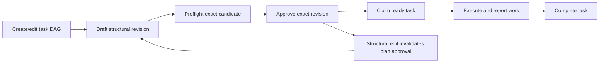

# GAT Basic Design

Document ID: GAT-BD-001  
Version: 1.0-draft  
Source inspection date: 2026-10-04  
Status: Formal project design draft for review. Parent: [Architecture Design](ARCHITECTURE_DESIGN.md).

**Source code is the source of truth for implemented behavior.** Historical/target documents inform comparison; they do not override current source.

## 1. Purpose and conventions

Define GAT features by actor, input/output, behavior and failure outcome. Current/Standalone/External/Target/Historical have the meanings in Architecture Design §1. Detail IDs link each feature to algorithms and source mappings. No feature status implies a newly executed verification or approved release.

## 2. Feature catalog

| Feature | Actor and input | Behavior / output | Status | Detail |
|---|---|---|---|---|
| BD-01 Session Team Enable | HUMAN via Remote; exact Lead Agent and signal | Resolve workspace/default roster, preflight model routes, provision sequentially, return source/diagnostics/member views | Current | DD-01, DD-02 |
| BD-02 Member lifecycle and recovery | Lead spawn request; persisted child history | Reserve immutable name/id, retain provisioning/active/failed phases, reconcile restart from child inbox/descriptor evidence | Current | DD-02, DD-03 |
| BD-03 Team state persistence | Authorized domain mutation; Session events | Serialize root mutations, append/flush events, project detached runtime-enriched views | Current | DD-03 |
| BD-04 Task board and dependency coordination | Team member; task fields/id/expectedRevision/action | Create/get/list/CAS update; validate DAG and ownership; report readiness and advisory write-scope overlap | Current | DD-04 |
| BD-05 Plan approval/import | Lead Remote credential; exact displayed revision or latest approved chat-plan evidence | Validate nonempty structural plan/preflight, import missing subjects, flush exact approval | Current | DD-05 |
| BD-06 Missions | Lead; title/objective/initial task snapshots or expected revision | Create/list/get/approve independently retained mission snapshots | Current baseline shortcut | DD-06 |
| BD-07 Messaging, waiting and interruption | Team sender/Lead; target/content/timeout | Durable queue, best-effort delivery/dedupe, bounded wait, interrupt current teammate turn | Current | DD-07, DD-08 |
| BD-08 Work status | Exact member; state/summary/reason/task/files | Validate self-report and persist latest member work view | Current | DD-08 |
| BD-09 Execution readiness and scoped tools | Exact Agent/tool name/arguments and live projection | Enforce readiness/repair admission and enabled-Team external name denial; contribute policy/preflight context | Current | DD-09 |
| BD-10 Browser/profile/distribution | HUMAN/Loader; profile config, Session id or install target | Mount Remote panel, refresh safely, apply YAML composition, install/verify/rollback controlled payload | Current | DD-10, DD-11 |
| BD-11 Conservative reference-memory governance | Trusted standalone host; identities/readiness/approvals/policy/request | Evaluate governed identity, partition isolation, audit, selector admission, safe wrapper result and conformance evidence | Standalone | DD-12, DD-13, DD-14 |
| BD-12 Durable member capabilities | Trusted external host; explicit declaration/ref/memory input | Provision context, selectively read, submit candidate, authorized commit, release with data retained | External | DD-15 |
| BD-13 Required member attachments | Initializer/binder/DSH host; normalized roster and attachment descriptors | Prepare/bind/recover before admitted model work, enforce bounds and reverse cleanup | Target | DD-16 |
| BD-14 Mission authority and Team-exclusive effects | Authenticated host; exact mission lease and capability classification | Bind task/mission revision and revalidate before every effect or wake; preserve structural repair exemptions | Target | DD-17 |
| BD-15 Contracted member task execution | PM/Team; normalized TaskContract and host PlanProposal | Execute one bounded internal plan, no delegation/queue, persist provisional terminal handoff and return idle | Target / accepted bounded PoCs | DD-18 |

## 2.1. Product goals behind the features

| Goal / WHY | Features | Documented origin and current limit |
|---|---|---|
| Reuse an opt-in coding team with one durable progress view | BD-01..BD-03, BD-10 | Golden V1 Objective / Existing foundation; feature reference §5 |
| Coordinate dependency-ready work and reject stale planning mutations | BD-04..BD-06, BD-09 | Golden V1 Team lifecycle / Canonical plan state; current simpleMode and mission shortcut differ |
| Preserve useful work and make explicit blockers/review evidence visible | BD-07..BD-08, BD-10 | Golden V1 Evidence and lessons applied / Member work state; stalls remain inference only |
| Prevent reference memory/LLM input from gaining authority or crossing scopes | BD-11..BD-12 | MCP proposal §§2,6,8–12; threat model §5; standalone/external integration limits remain |
| Separate Team lifecycle from capability persistence and prevent unbound execution | BD-12..BD-14 | Feature reference §§7.1–7.2 and member freeze §§1–3,7–11; required binder/mission lease are target-only |
| Keep a member's execution bounded and acceptance external | BD-15 | Collected Agile baseline / compatibility memo; PoCs and unfinished BS1 do not establish production GAT implementation |

Each DD entry contains a WHY paragraph with its exact supporting document sections and distinguishes documented intent from inferred trade-offs. Architecture Design §5.1 summarizes decision-level rationale. No numerical constant is justified by invented benchmark evidence.

## 3. Session Enable and roster flow

Precondition: GAT host profile loaded, exact live root Lead, one initializer registered. In simple mode a Session without durable teammate rows starts solo.

1. Web invokes `agentTeams/enable` for that Session.
2. Existing retained teammate rows return `alreadyEnabled: true` and source `existing`.
3. Otherwise core deduplicates concurrent Enable calls for the exact Lead object.
4. Read literal `<session.cwd>/team_members.yaml`; malformed/missing/oversized/symlink configuration yields built-in defaults and safe diagnostics.
5. The default initializer returns normalized specs after route preflight; core validates all names, content blocks, routes and attachments before the first spawn.
6. Core provisions empty-attachment members sequentially with v3 durable evidence; required attachments fail closed until qualified reserved-host composition exists.
7. Install scoped Team policy/tools and refresh projected views.

A later provisioning failure can leave earlier members intact. Enable is not an all-or-nothing roster transaction. Current V1 has no destructive Disable or declaration reload of an already retained roster.

## 4. Task and approval flow

The diagram describes the legacy plan-gated flow. Current `simpleMode: true` skips the Team-plan approval diagnostic in tool readiness; envelope/member checks still apply. Current defaults require two active durable teammates. Historical Lead-only minimum zero is a different mission baseline.

Each update compares expected task revision before mutation. Readiness requires completed blockers; deleted/cyclic/missing dependencies reject. Claim/release/complete/reopen/reassign enforce distinct owner/Lead transitions. Write scopes are coordination metadata, not filesystem grants.

Plan import reads the latest matching `exit_plan_mode` approval evidence, extracts explicit Tasks subjects, normalizes/deduplicates against nondeleted tasks and prepares all checks before appending imported task events and approval in one flush.

## 5. Mission flow and authorization gap

Current create is Lead-only and persists revision 1 with status `approved`, embedded plan tasks and approval revision 1. The explicit approval method accepts only a draft at the expected revision. This baseline does not establish an authenticated HUMAN mission event or a task-to-mission execution lease.

Target flow: host-attested exact HUMAN authorization → GAT scope lease → canonical task claim/association → effect-boundary revalidation. Draft/model-created, stale, wrong-Team, ambiguous, closed or revoked authorization denies effects. Current mission methods/types are not a complete create/activate/close/revoke lifecycle.

## 6. Communication and work flow

Sending resolves an exact Team target, validates bounds, queues a root event then attempts delivery. Target Session message identity deduplicates retries. Delivery uncertainty leaves a queue item recoverable; interruption cancels a current turn without deleting pending inbox work.

`wait_agent` waits on activity/cancellation/timeout rather than repeatedly polling model tools. Work reports use `working`, `blocked`, `review_required`, `done`; task completion and a `done` work report remain separate mutations. The Web panel samples the latest created mission and roster; selection is presentation, not execution authority.

## 7. External member capability and target binding flow

External service workflow: validate explicit scope → provision opaque ref → bind Consumer → open metadata context → selective reads/candidate submission → authorized confirmed commit → release/drain. Candidate submission is never approval.

Target GAT binder adds roster-level prepare-all, materialize-without-admit, binding contributions, quarantined inbox and guarded activation. All V1 attachments are required. Failure/recovery cannot silently remove an attachment or execute an unbound member. Persistent capability data survives Session/Team disposal.

The contracted task-runner stream is separate: one task remains busy through handoff-pending; completed effects do not replay; unsettled current effects become unknown outcomes; atomic provisional handoff settlement permits idle without PM acknowledgement. Accepted P0/P1/P2 conclusions do not grant production integration.

## 8. Interface and data overview

| Interface/data | Producer → consumer | Notes |
|---|---|---|
| `TeamView` | Core → tools/Web | Enabled, plan revision/approval, members/tasks/work and optional missions |
| `SpawnTeammateRequest` | Scoped tool/initializer → core roster | Name/description/prompt/context/continuation provider/AgentOptions/signal |
| Task snapshots and mutation results | Core board → model/Remote | Task revision, dependencies, owner and write scopes; typed rejection |
| Mission snapshots | Core mission board → Web/tools callers | Current embedded plan tasks; target normalization is deferred |
| `TeamMessageSnapshot` and source receipt | Core mailbox → DSH inbox | Stable message/sender/target correlation |
| Work snapshot | Exact member → root projection | Latest status/evidence; no independent acceptance authority |
| `DurableAgentRef` and context | External provider → Consumer/binder | Opaque generation-bound ref; path-free selective context |
| Required attachment record | Target capability binder → GAT journal | Opaque bounded canonical value/digest/version |
| TaskContract / PlanProposal / TaskHandoff | Target PM/host/member boundaries | Source-agnostic identity and provisional outcome |

## 9. Acceptance and maintenance

[Source Code Map](SOURCE_CODE_MAP.md) lists the fixtures to assess each current/standalone/external feature. Target features list missing production implementations and reference sources explicitly. Documentation checks validate links, design-ID coverage, symbols and baseline hashes; they do not substitute for behavioral suites.

When source changes, update the affected DD contract and mapping, then reconcile BD/AD only if behavior/ownership changes. Preserve collected snapshots and historical acceptance records. Promotion to Truth or wiki authority requires the applicable separate review gate.

## 10. Approved binding implementation delta — AIP-EXEC-022

HUMAN approval dated 2026-10-04 selects proposal P-01–P-08 and WK/direct-continuable composition. Detail Design §5 defines intended contracts before implementation. BD-01 moves provisioning ownership from the initializer into core; BD-02/03 add v3 bounded records with strict v2 replay; BD-12/13 add the required WK adapter and generic binding lifecycle. BD-09/14 retain exact host authority as a production dependency. BD-10 exposes only safe binding summaries and qualifies new composition/build/install mappings. Unsupported or corrupt required capabilities never fall back to unbound execution. These planned changes remain distinct from production qualification and from isolated-only closing fixtures.

## 11. Qualified foundation versus production

AIP-EXEC-022 adds normalized initialization, v3 attachment replay, safe binding summaries, generic lifecycle ports and the separate WK adapter. BD-13 has tested foundation code; production admission remains Target. BD-14 exact authority remains Target. Core and tool guards exclude unavailable bindings, including queued legacy recovery. WK/global or fork declarations reject; explicit Durable YAML never falls back. See Detail Design §6 and the source map for current implementation and workspace evidence.

## 12. Approved prerequisite behavior — AIP-EXEC-023

HUMAN authorized isolated host prerequisite implementation on 2026-10-04. Intended ownership and behavior are defined in [Detail Design §7](DETAIL_DESIGN.md#7-approved-prerequisite-implementation-delta--aip-exec-023): DSH owns reserved/quarantined child lifecycle, pre-render request refresh and immutable nested dispatch capabilities; GAT owns host-attested exact mission/task leases and effect/model admission. WK/direct-continuable target remains fixed. Deployment stays separate and prerequisite eligibility requires actual conformance evidence.
