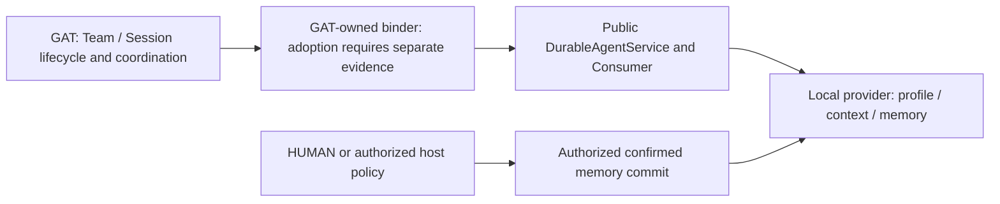

# GAT Durable Agent integration — design reference

**As of:** 2026-10-04  
**Status:** Draft reference synthesis; service mission accepted, GAT binder adoption unverified.  
**Primary evidence:** [Integration report](sources/gat-durable-agent-integration/integration-report.md), [final report](sources/gat-durable-agent-integration/final-report.md), [decisions](sources/gat-durable-agent-integration/decisions.json).

For implemented behavior, use the source-aligned [formal detail design](DETAIL_DESIGN.md) and [code map](SOURCE_CODE_MAP.md). Source code is the source of truth; this page records collected design/mission evidence.

## Purpose and authority

Cập nhật góc nhìn integration từ MiniMVP file-based context sang versioned Durable Agent service. Mission `gat-durable-agent-integration` hoàn tất ở WBS r2; final acceptance là `decision-human-accept-mission-017`. Report giữ nguyên câu pending acceptance vì đó là bytes đã trình duyệt; ledger ghi quyết định đến sau.

Acceptance giới hạn ở Durable Agent capability và compatibility adapter. Mission loại trừ GAT-owned binder, Agent Session/Team lifecycle adoption và package publication/deployment. Tài liệu này không xác nhận binder hiện có trong GAT; task triển khai phải kiểm source/tests và contract freeze.

## Architecture and responsibility boundaries

| Owner | Owns | Boundary |
|---|---|---|
| GAT | Team roster, root Session journal, member Sessions, missions/tasks/mailbox/work projection | Durable Agent memory is not a second Team lifecycle authority |
| GAT integration adapter/binder | Mapping exact member identity into provision/bind/inject/release and scope teardown | Separate design/implementation proof required; no unrestricted Team mutation |
| Durable Agent service | Versioned API, feature flags, bounded DTOs, semantic errors, opaque refs, snapshots/selective reads | No GAT dependency or implicit global member discovery |
| Local provider | Profile authority, workspace/global isolation, persistent member memory, mutation/recovery | Private generation paths are not a host API |
| Consumer | One explicitly bound opaque ref; deterministic path-free model context and memory tool contract | No implicit binding, broad memory dump or host discovery |
| HUMAN / explicitly authorized host | Approval policy and authorization-bearing confirmed memory commits | Candidate text cannot grant approval |

## Public integration contract

Use the service/Consumer exports, not filesystem layout. The mission exercised real plugin registration → service → provision → bind → snapshot composition.

- Provision from an explicit declaration with workspace/global scope and immutable profile authority.
- Bind exactly one opaque member ref to the Consumer scope. Stale, foreign, released or scope-mismatched refs fail closed.
- `openTaskContext` returns a frozen path-free context snapshot and metadata-only catalog.
- `readMemoryItem` selectively reads one memory item; do not assume a task snapshot pins later reads. Consistency is per public call, not cross-call snapshot affinity.
- `submitMemoryCandidate` yields unconfirmed/non-canonical data. Approval-looking body text or provenance does not authorize it.
- `commitMemoryItem` requires explicit valid authorization for the committed item and publishes confirmed memory through the governed mutation path.
- Release closes admission, drains admitted mutations, invalidates the ref, and preserves storage for later reprovisioning.
- Treat `workingLocation` as a trusted opaque capability; do not inspect or derive adjacent provider-private paths.

Exact service signatures, error codes, bounds and features must be checked against the public package docs/source before coding. This synthesis is not a substitute API declaration.

## Persistence and recovery design

The accepted [memory protocol](sources/gat-durable-agent-integration/memory-protocol-qualification.md) chooses immutable content objects and generation manifests with atomic current-pointer publication.

1. Before an immutable mode anchor exists, independently validated legacy memory is eligible.
2. Bootstrap publishes complete durable objects and generation-zero manifest before the anchor and current pointer.
3. Once the anchor exists, legacy flat files cannot regain canonical authority. Retained compatibility writers perform a final under-lock discriminator recheck and refuse authorization-free writes after bootstrap.
4. Later commits preserve old authority until pointer replacement; the selected result is a complete old or new generation.
5. Corrupt authoritative bytes or established pointer loss fail closed. Do not guess the newest generation by directory order or replay staging.
6. Same-isolate mutations serialize by storage identity through a process-wide FIFO. Participating cross-process overlap fails closed through an exclusive mutation lease; different members remain independent.
7. Reads validate bounded UTF-8/NUL, scope, versions, symlink and integrity constraints. Generation history is bounded; compaction/migration remains separately designed work.

These provider durability semantics differ from the cancelled Sprint-1 runner checkpoint, whose claim was atomic local replacement without power-loss durability. Do not transfer one subsystem's guarantee to another.

## Verification evidence and limits

`integration_verify-a03` recorded 10 test files and 127 passing tests, plus build, named-export and packed-profile smoke checks on settled bytes. This is collected mission evidence, not a test rerun in the GAT repository. Bootstrap/commit fault injection, independent raw oracles, FIFO/release, migration and two-member isolation were included.

Residual deployment constraints include supported rename/fsync filesystem behavior, operator handling of stale mutation leases, participating-writer assumptions, bounded history, and explicit memory approval policy. Package release and actual GAT adoption need their own evidence.

## Design impact for GAT tasks

The existing feature reference §7 describes an older MiniMVP target. Use this document for the accepted service capability while preserving §4–6 GAT Team/Enable/roster ownership and the [member-binding freeze](../GAT_MEMBER_BINDING_CONTRACT_FREEZE.md).

A future binder task should demonstrate explicit Session/Team scope ownership, member identity binding, context/tool injection, candidate approval policy, release drain, cancellation/teardown and restart behavior in GAT composition tests. Durable task execution from the Agile/PoC/BS1 line is a separate design stream; the completed service mission does not implement that task runner.

## Approved WK adapter baseline — AIP-EXEC-022

The HUMAN approved proposal P-01–P-08 on 2026-10-04 and selected WK-style public DA APIs with existing direct-continuable GAT members. Intended payload, ownership, executable tool, request-refresh and cleanup contracts are defined before code in [Detail Design §5](DETAIL_DESIGN.md). Use workspace/fresh, a dedicated provider and exclusive workspace/name owner; context snapshots and later reads remain per-call consistent. Recovery validates trusted host workspace/registration and persisted declaration, obtains a fresh process ref, and never reloads mutable YAML. Model tools read one item or submit an unconfirmed candidate; confirmed commit stays separately host-authorized. No provider-private storage/API change or official DSH Consumer adoption is implied. Production adoption still needs exact reserved-host, refresh and mission/executor qualification; fake-scope/temporary-provider evidence must be labeled separately.

## AIP-EXEC-022 foundation implementation

The selected WK adapter library is packages/durable-agent. It validates strict workspace/fresh declarations, persists only bounded declaration payloads, coordinates exclusive live identities and installs read/candidate tools and refresh through a trusted capability scope. Temporary public-provider and deterministic-port verification are recorded in the AIP workspace. Production composition remains unavailable until the reserved-child, request-refresh and exact authorization dependencies qualify; current core rejects required attachments before member creation. No isolated known-closing behavior is claimed for the selected direct-continuable target.

## Prerequisite implementation — AIP-EXEC-023

HUMAN authorized isolated host prerequisite implementation on 2026-10-04. Intended ownership and behavior are defined in [Detail Design §7](DETAIL_DESIGN.md#7-approved-prerequisite-implementation-delta--aip-exec-023): DSH owns reserved/quarantined child lifecycle, pre-render request refresh and immutable nested dispatch capabilities; GAT owns host-attested exact mission/task leases and effect/model admission. WK/direct-continuable target remains fixed. Deployment stays separate and prerequisite eligibility requires actual conformance evidence.
