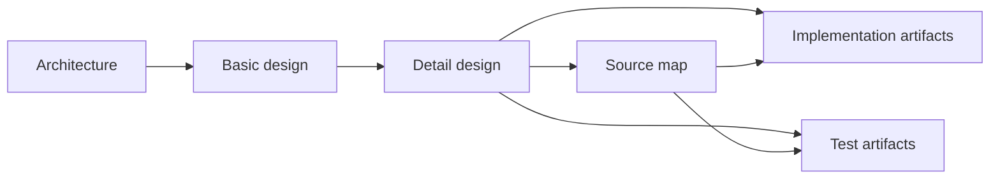

# GAT wiki registration

Registered on 2026-10-04 under the HUMAN-approved batch `INGEST-20261004-GAT-DESIGN`.

| Registered artifacts | Count |
|---|---:|
| Formal designs and supporting references | 8 |
| Implementation/configuration source files | 38 |
| Test source files | 26 |
| Total | 72 |

The wiki contains 240 new typed relations: architecture → basic → detail → source map; navigation from the collection; upstream rationale inputs; document → implementation/test artifacts; and literal source imports. Relations support traversal in both directions. Tests are registered as fixtures, without claiming a passing product test run. DD-16 through DD-18 remain target designs without production implementation edges.



```sh
python3 .ai-work/tooling/lookup_wiki_source.py --query 'GAT Architecture Design'
python3 .ai-work/tooling/wiki_relations.py --relations SRC-GAT-DETAIL-DESIGN
python3 .ai-work/tooling/wiki_relations.py --relations SRC-GAT-CODE-PACKAGES-CORE-SRC-ROSTER-TS
```

Source code is authoritative for implemented behavior; design documents are working references. Historical/proposed contracts retain their documented status. External Durable Agent sources require the sibling `../dsh-durable-agent` checkout. Source hashes are recorded in [source-baseline.json](source-baseline.json); mappings and wiki source IDs are in [source-code-map.json](source-code-map.json).

Optional logical object candidates and proposed object relations remain [workspace suggestions](../../.ai-work/workspaces/hoinv/TASK-20261004-gat-design-wiki/object-candidates.md). Artifact registration and document-to-code relations are complete; these optional suggestions were not authored as logical nodes.

Verification results are recorded in [design-verification.json](design-verification.json). Product code and tests were not changed or executed for this wiki operation.

Final checks: **367/367 lookup checks passed**, all 240 planned relations present, no broken relation references, and all 64 source/test hashes unchanged. Whole-tree lint: **0 errors, 37 warnings**; wiki lint: **0 errors, 25 warnings**. Remaining warnings concern existing maintenance/AIP/capture/handoff/tooling issues; full reports are retained in the task workspace.
