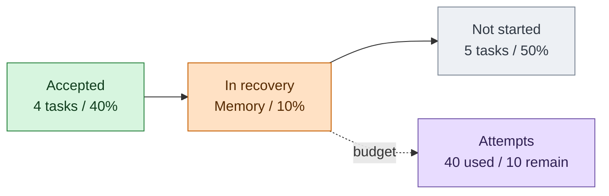
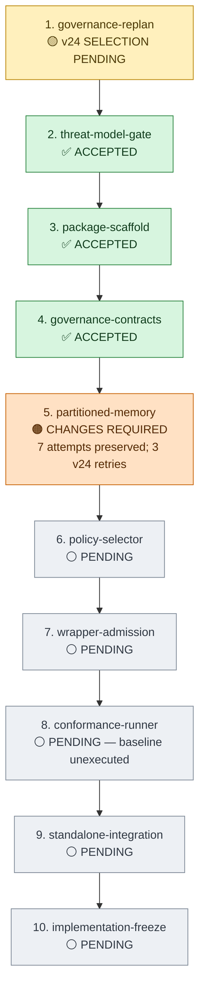
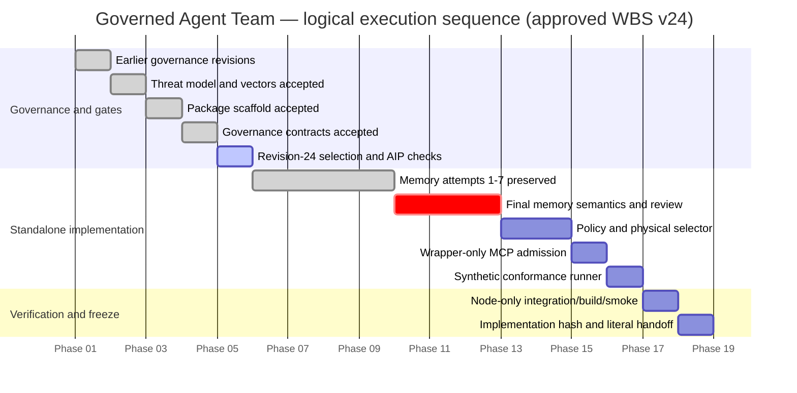
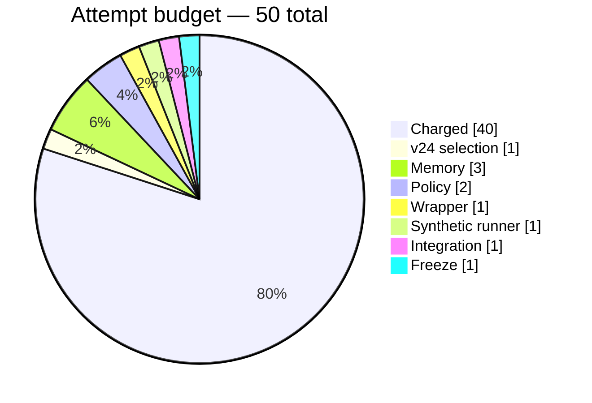

# Governed Agent Team — WBS Progress

> Snapshot: HUMAN-approved WBS revision 24, SHA-256 `af07afcc1e0d45467632c58715a12f1d8969fbdb38dedb101b27c606091891fb`  
> Execution ledger currently selects revision 23; revision 24 awaits its bounded governance reconciliation/AIP verification.  
> Progress uses **independently accepted tasks / 10 tasks**. Gantt dates are logical phase-days, not calendar estimates.

## Summary

- **Accepted:** 4 / 10 = **40%**
- **Touched:** 5 / 10 = **50%**
- **Attempts charged:** 40 / 50 = **80%**
- **Attempts remaining under approved v24:** 10
- **Current control action:** select exact revision 24, align the active STEP-08 AIP, and pass lint/status.
- **Next product action:** `partitioned-memory` attempt 8, limited to the five independently reviewed semantic residuals.
- **Hard boundaries:** no DSH access/install/build; no accepted-baseline conformance execution; no npm/pnpm/network/external dependencies; AIP remains active; proposal remains inactive.

## Overall progress

## WBS dependency view

## Logical Gantt

## Task status

| # | Task | State | Attempts | Accepted output / next gate |
|---:|---|---|---:|---|
| 1 | `governance-replan` | 🟡 v24 reconciliation | 8 used / 9 | Select exact v24, align AIP, run lint/status |
| 2 | `threat-model-gate` | ✅ Accepted | 3 used | HUMAN-bound threat/vector hashes |
| 3 | `package-scaffold` | ✅ Accepted | 2 used | Zero-dependency ESM scaffold and reviewed deterministic freeze/smoke |
| 4 | `governance-contracts` | ✅ Accepted | 3 used | ProjectScope/Desk/readiness/Team-plan/native Mission bindings |
| 5 | `partitioned-memory` | 🟠 Changes required | 7 used / 10 | Correct reference-only semantics, provenance, audited denials, audit-read isolation, and every-operation replay |
| 6 | `policy-selector` | ⚪ Pending | 0 / 2 | Deny-first PDP and one physical selector |
| 7 | `wrapper-admission` | ⚪ Pending | 0 / 1 | Wrapper-only admission; raw MCP denied before backend |
| 8 | `conformance-runner` | ⚪ Pending | 0 / 1 | Synthetic runner tests only; accepted baseline stays unexecuted |
| 9 | `standalone-integration` | ⚪ Pending | 0 / 1 | Combined Node tests, deterministic build, clean built smoke |
| 10 | `implementation-freeze` | ⚪ Pending | 0 / 1 | Frozen implementation hash and literal-path conformance handoff |

## Attempt budget

## What happens next

1. Reconcile and select exact WBS v24; update the active AIP and verify lint/status.
2. Implement memory attempt 8 against only the five pinned residuals.
3. Run the exact three-file memory test command once and obtain independent storage review.
4. If accepted, continue serially through policy → wrapper → synthetic runner → Node-only integration → deterministic freeze/handoff.
5. Ask the HUMAN for final standalone-phase acceptance. The accepted conformance baseline and DSH installation remain separate future approvals.

## What the HUMAN needs to do

- **Now:** nothing; exact WBS v24 approval is already recorded.
- **If another real scope/budget decision appears:** approve or reject the new exact hash; implementation does not self-authorize drift.
- **At standalone freeze:** review and accept/reject the exact final implementation hash and literal-path handoff.
- **Later, separately:** decide whether to approve the conformance-execution WBS and, after its evidence, any DSH installation/activation phase.

## Progress interpretation

The 40% figure is intentionally conservative. Memory has a green 11/11 focused suite and several hard protocol properties already closed, but attempt 7 failed independent semantic review. It therefore remains outside accepted progress until the exact v24 residuals pass both tests and independent review.
